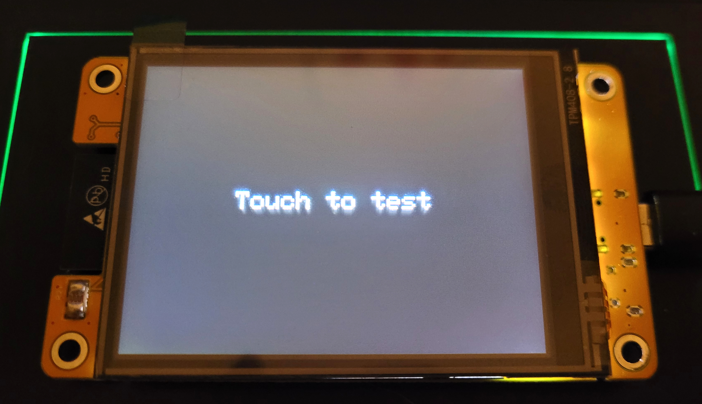

# CYD2USB (ESP32-2432S028) sample sketch

This project is a sample setup for the **ESP32-2432S028** (aka **CYD – Cheap Yellow Display**), featuring a 2.8" 240x320 resistive touchscreen with an **ST7739** driver. It aims to help developers get started with the device, especially those who have struggled to get both the display and touchscreen working together.

## CYD2USB trivia

Why **CYD**? Because it is simply a **CYD – Cheap Yellow Display**. CYD comes in different flavours, so one needs not to be identical to other one.

So why **CYD2USB**? Because it has two USB ports - micro USB and USB-C.  

There are many **ESP32-2432S028** clones, and not all are designed the same. The **CYD2USB** itself comes with three or more variants.

In **CYD**, the touch controller and display controller are decoupled — one is connected via HSPI, the other via VSPI. While [Bodmer’s TFT_eSPI](https://github.com/Bodmer/TFT_eSPI) library is widely used for ESP32-controlled displays, it can be difficult or even impossible to get both the touchscreen and display working simultaneously on some CYD variants.

To address this, the [TFT_eTouch](https://github.com/achillhasler/TFT_eTouch) library is used to decouple the touchscreen GPIOs from the display ones.

That is it, in a nutshell.

## Dependencies & configuration

This project is developed with ``VS Code`` and ``PlatformIO``, however feel free to manage it however you wish. You may tailor it to work with ``Arduino IDE`` (remember, the ``.ino`` files are basically ``.cpp``). Also, as said before, this project relies on **TFT_eTouch** library that needs to be added manually to ``.pio/libdeps/esp32doit-devkit-v1/`` upon clone or download & unzip.

In the root directory you will also find **User_Setup.h** that is already pre-configured for our **CYD**. Copy and replace it with the one in ``.pio/libdeps/esp32doit-devkit-v1/TFT_eSPI``.

## Useful links

 - https://github.com/witnessmenow/ESP32-Cheap-Yellow-Display
 - https://github.com/rzeldent/platformio-espressif32-sunton